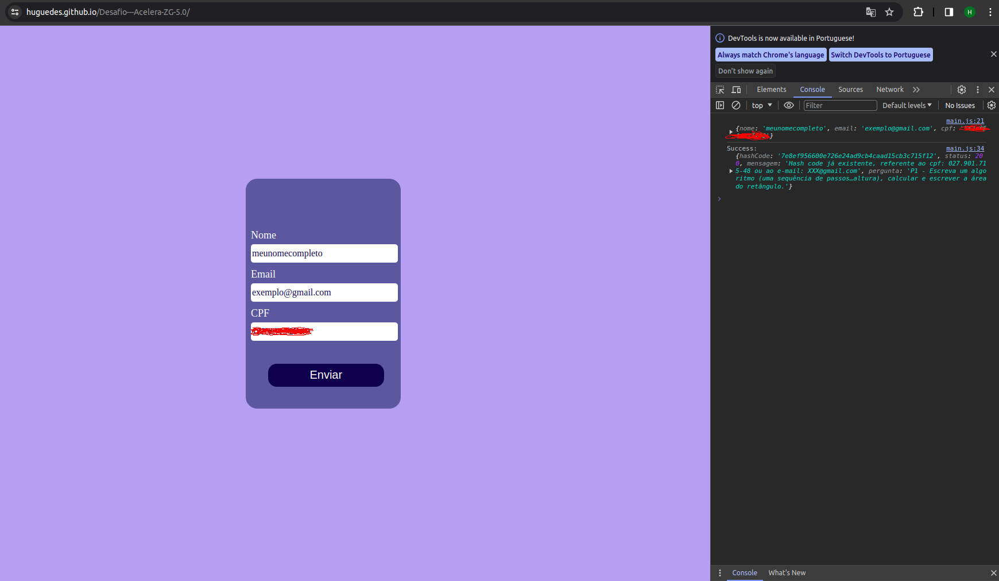

# Desafio---Acelera-ZG-5.0

:warning:<h2>Atenção</h2>

Este site não está responsivo.

<h2>Desafio</h2>

O desafio foi fazer uma requisição do tipo POST, ou seja, mandar os seguintes dados: Nome, Email, CPF.

Ao obter sucesso no envio dos dados o retorno do servidor foi um código hash e uma pergunta que foram usados na continuação do desafio.

<h2>Execução</h2>

Eu fiz a interação dos inputs no HTML com o Script usando o DOM. Usei o Fetch e json para criar a requisição do tipo "method: POST".

O grande desafio foi enviar um CPF que fosse aceito pelo servidor. O envio de tal estava tudo conforme o pedido na descrição da tarefa, "cpf deve conter pontos e traço XXX.XXX.XXX-XX". passei algumas horas tentando descobrir o que poderia ser, e por fim descobri que a forma como os pontos e o traço estava sendo lido no URL da requisição, não estavam conforme o aceitavel. Por fim, deu tudo certo! :)

<h3>Abra a versão web do mini projeto:</h3>
$ https://huguedes.github.io/Desafio---Acelera-ZG-5.0/ 
 

<h2>Imagem</h2>

